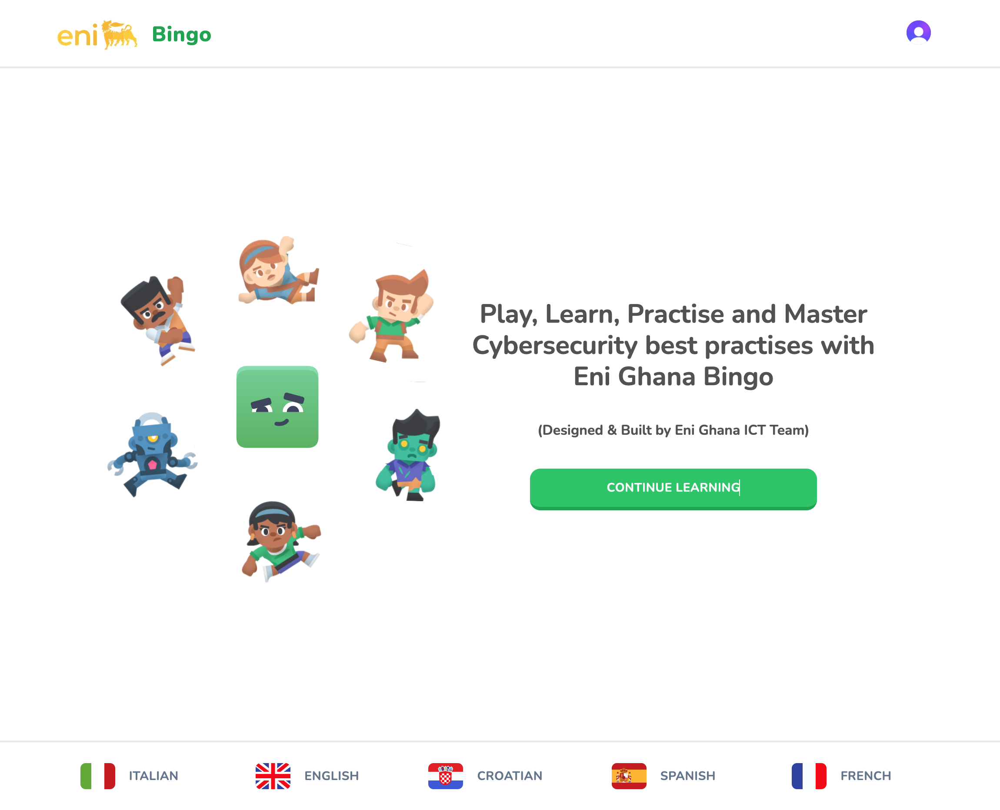
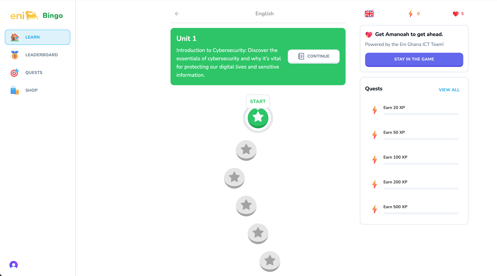
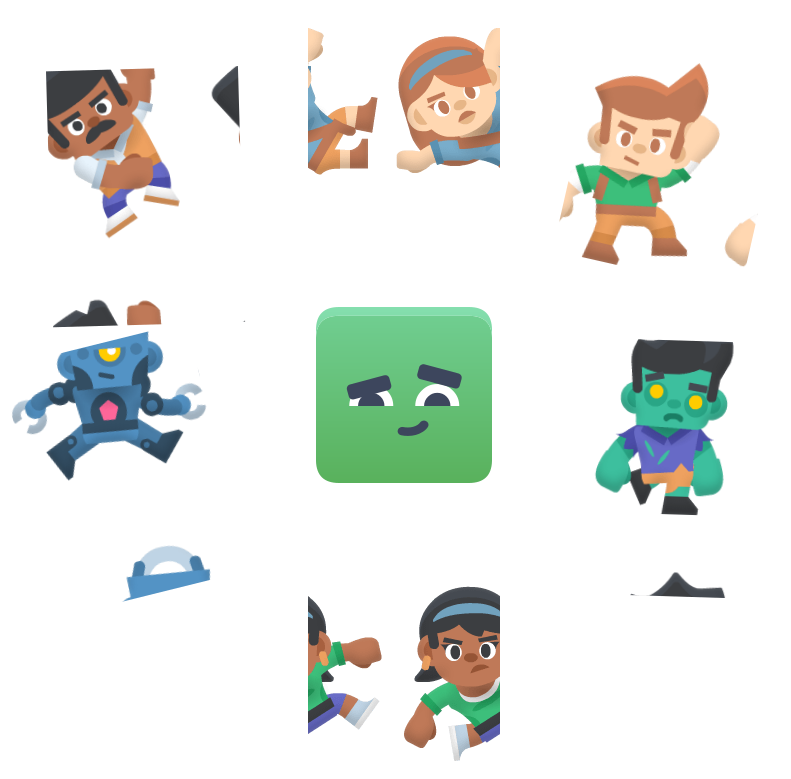
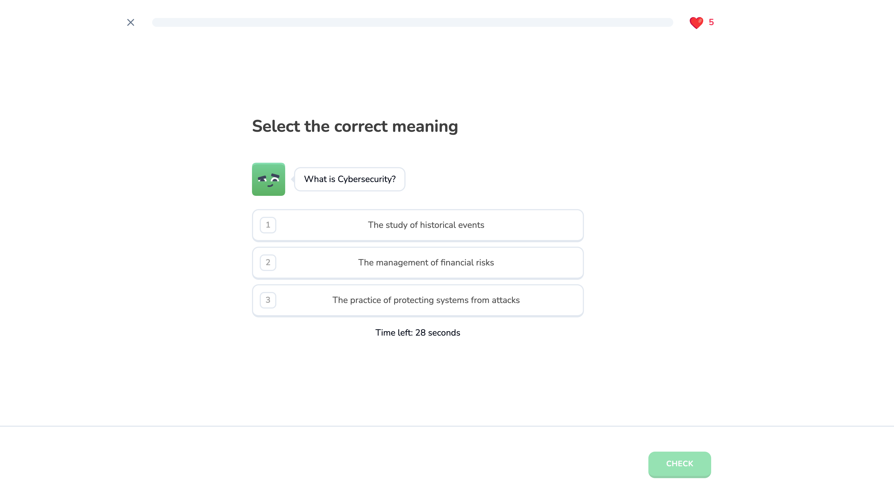

  
  # 🎮 Eni Ghana Bingo
  
  
  
  
  
  

  

    <strong>🌟 Learn, Play, and Win with Eni Ghana's Interactive Learning Game! 🌟</strong>
  

---

  
  
  

## 📋 Table of Contents

Click to expand

- [✨ Features](#-features)
- [🚀 Getting Started](#-getting-started)
- [🎯 How to Play](#-how-to-play)
- [💯 Scoring System](#-scoring-system)
- [💖 The Amanoah System](#-the-amanoah-system)
- [🔄 Practice Mode](#-practice-mode)
- [🏪 Store](#-store)
- [📸 Screenshots](#-screenshots)
- [💡 Pro Tips](#-pro-tips)
- [🤝 Support](#-support)

## ✨ Features

  

- 🌍 Multi-language support
- 🎯 Interactive quiz gameplay
- 💖 Unique Amanoah (hearts) system
- 🏆 Real-time leaderboard
- 🔄 Practice mode for learning
- 🏪 In-game store

## 🚀 Getting Started

  

1. Request your credentials from the Eni Ghana ICT Team
2. Visit [Eni Ghana Bingo](https://enighana-bingo.vercel.app/leaderboard)
3. Sign in with your provided credentials
4. Select your preferred language
5. Begin your learning adventure! 🎉

## 🎯 How to Play

  

The game guides you through interactive modules where you:

- Answer questions to earn points
- Manage your Amanoah (hearts)
- Progress through different levels
- Practice completed modules

## 💯 Scoring System

|      Action       |   Reward   |
| :---------------: | :--------: |
| ✅ Correct Answer | +10 points |
|  ❌ Wrong Answer  | -1 Amanoah |

## 💖 The Amanoah System

  

Our unique Amanoah system represents your game life:

| Letter | Meaning           | Description                                     |
| :----: | :---------------- | :---------------------------------------------- |
|  🎯 A  | **A**nswering     | The core activity of learning through questions |
|  🌟 M  | **M**otivation    | The drive to keep improving                     |
|  🏆 A  | **A**chievement   | Your progress and success                       |
|  📚 N  | k**N**owledge     | The wisdom you gain                             |
|  🚀 O  | **O**pportunities | Chances for growth and learning                 |
|  ✨ A  | **A**ccuracy      | Precision in your responses                     |
|  ❤️ H  | **H**earts        | Your life force in the game                     |

## 🔄 Practice Mode

  

- 🔁 Return to completed modules anytime
- 📝 Practice without point pressure
- 📚 Perfect for learning and review

## 🏪 Store

  

- 💝 Replenish your Amanoah (hearts)
- 💰 Cost: 10 points per full heart refresh
- 🛍️ Special power-ups and boosters available

## 📸 Screenshots

  

    
     
  

  

    
    
  

## 💡 Pro Tips

  

- 🎯 Use practice mode to build confidence
- 💖 Manage your hearts wisely
- ⏰ Take your time with each question
- 📚 Learn from incorrect answers

## 🤝 Support

  
  ### Need Help?
  
  Contact Eni Ghana ICT Team for technical support
  
   
  
  
  
   
  
  

    <strong>Made with ❤️ by Eni Ghana</strong>
  

  

